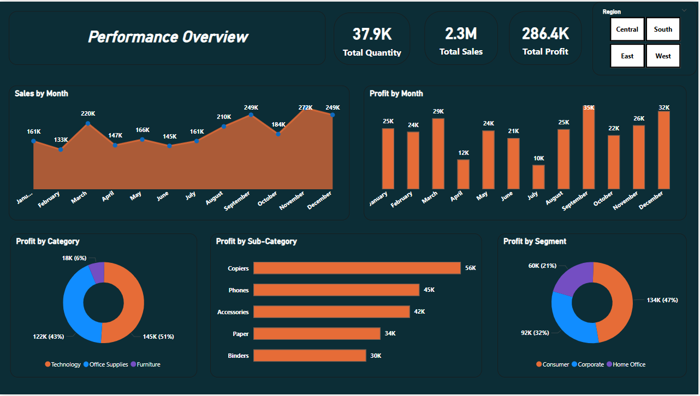
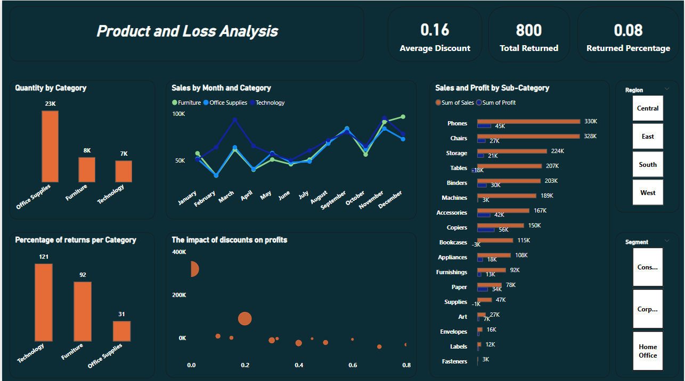
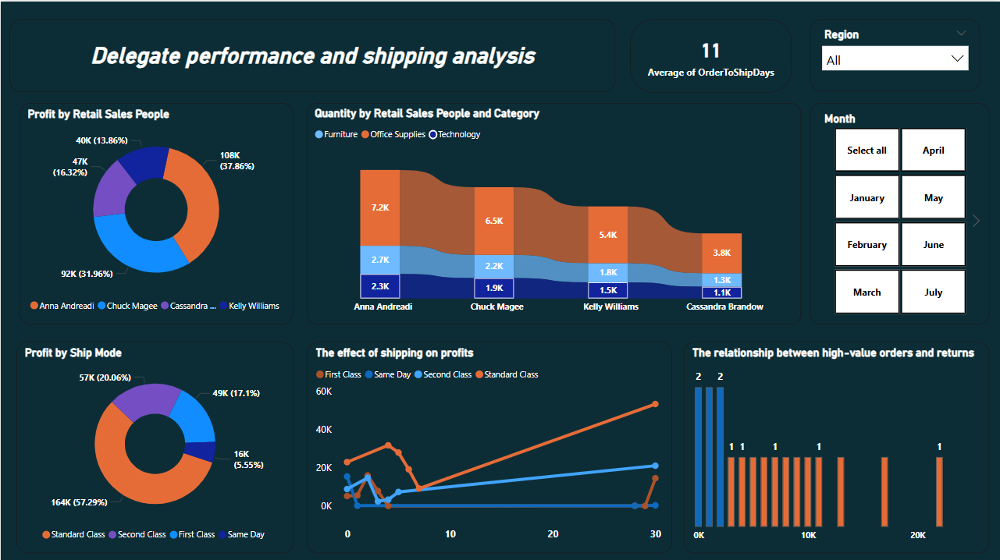
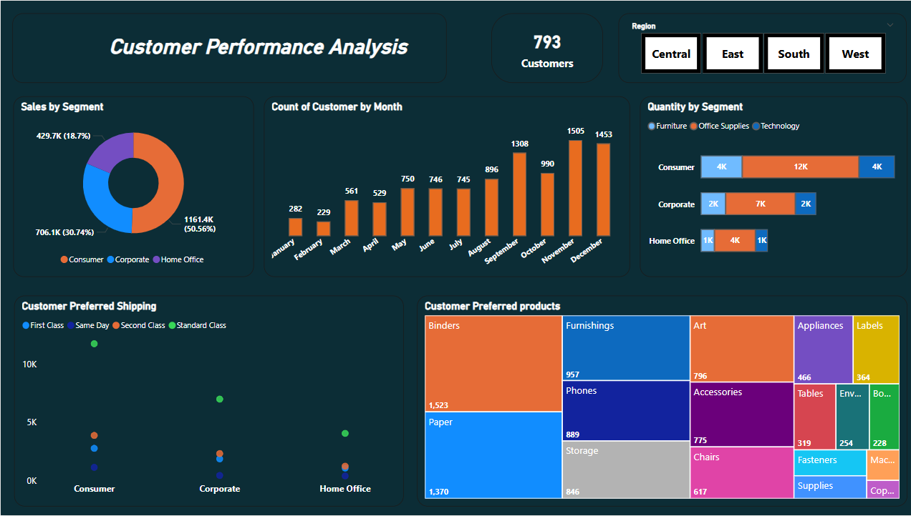
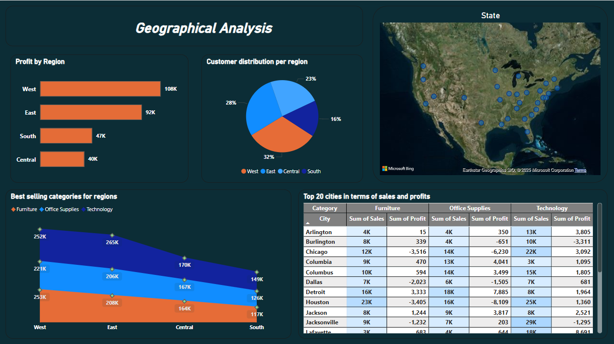

# 📦 Retail Sales & Supply Chain Dashboard – Power BI

An interactive Power BI dashboard to analyze sales, profit, returns, shipping, and customer behavior across regions and product categories in a retail business.

---

## 🎯 Project Objective

- Monitor overall sales, profit, and quantity performance across months
- Understand the impact of returns, discounts, and shipping modes on profitability
- Evaluate segment and product category performance
- Analyze retail employee performance and customer preferences
- Identify regional strengths and weaknesses using geographical insights

---

## 🛠 Tools

- **Tool:** Power BI (Power Query, DAX, Visualizations)
- **Visuals Used:** Bar charts, pie charts, KPIs, line charts, maps, scatter plots

---

## 📊 Dashboard Sections

- Sales & Profit Performance Overview
- Category & Sub-Category Breakdown
- Returns & Discount Analysis
- Shipping Impact on Profit
- Sales People Contribution & Delegation
- Customer Segments & Product Preferences
- Geographic Sales Distribution (States & Cities)

## 🖼️ Dashboard Preview

### Performance Overview

### Product

### Shipping & Discounts Impact

### Customer 

### Region Insights

📄 [Download Dashboard PDF](Retail-Supply-Chain-Sales.pdf)

