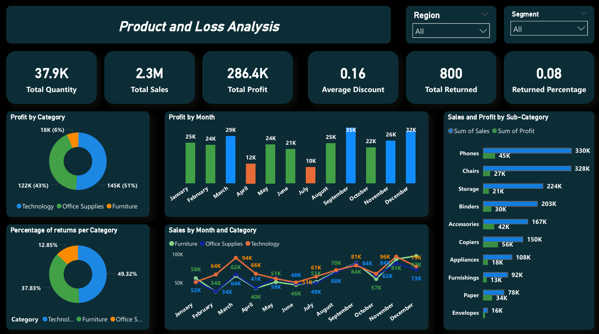
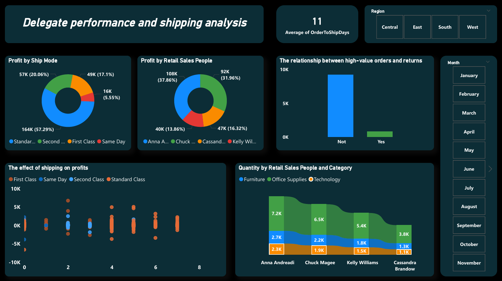
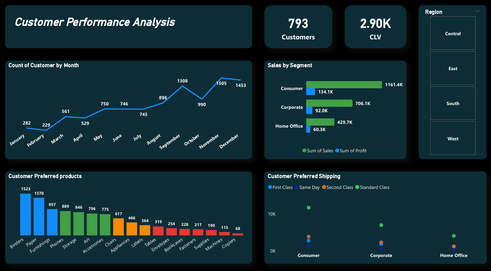
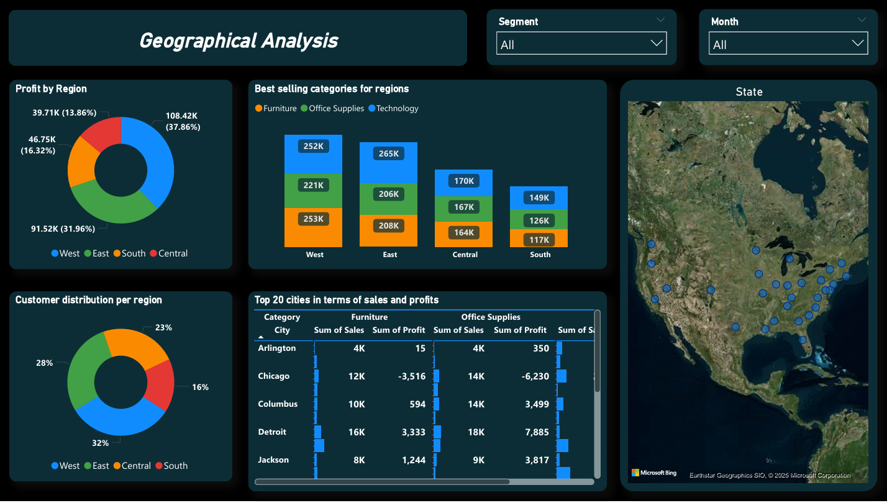

# Sales Performance Dashboard

##  Project Overview
Interactive Power BI dashboard analyzing $2.3M in sales across 793 customers, providing insights into customer behavior, product performance, and regional trends.

##  Key Insights
- Technology category drives 51% of total profit
- Customer Lifetime Value: $2,900
- West region leads with 37.86% profit contribution
- Exceptional 0.08% return rate

##  Tools & Technologies
- Microsoft Power BI
- DAX (Data Analysis Expressions)
- Power Query

##  Dashboard Features
- 4 interactive analysis pages
- 20+ dynamic visualizations
- Real-time filtering by Region, Segment, Month
- KPI cards for key metrics

##  Project Structure
- `/Dashboard` - Power BI files
- `/Report` - Detailed analysis report
- `/Data` - datasets
- `/Images` - Dashboard screenshots

##  Dashboard Preview

📄 [Download Dashboard PDF]([Sales%20Performance%20Analysis%20Dashboard.pdf])

##  Full Report
View the complete analysis report [here]([Sales%20Performance%20Analysis%20Report.pdf])

##  Skills Demonstrated
- Data cleaning and transformation
- Advanced DAX calculations (CLV, profit margins, YoY growth)
- Interactive dashboard design
- Business intelligence insights
- Data storytelling

##  Contact
[Ali Rabie] | [[LinkedIn](https://www.linkedin.com/in/ali-r-ba4086342/)] | [alirabie0128@gmail.com]
