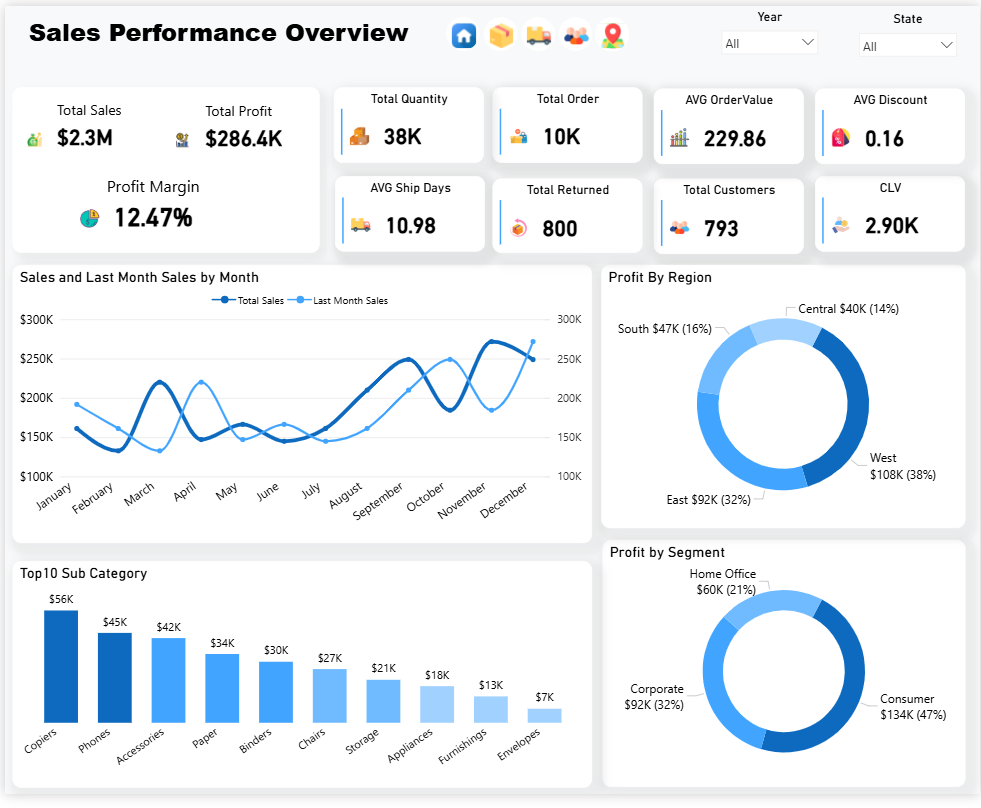
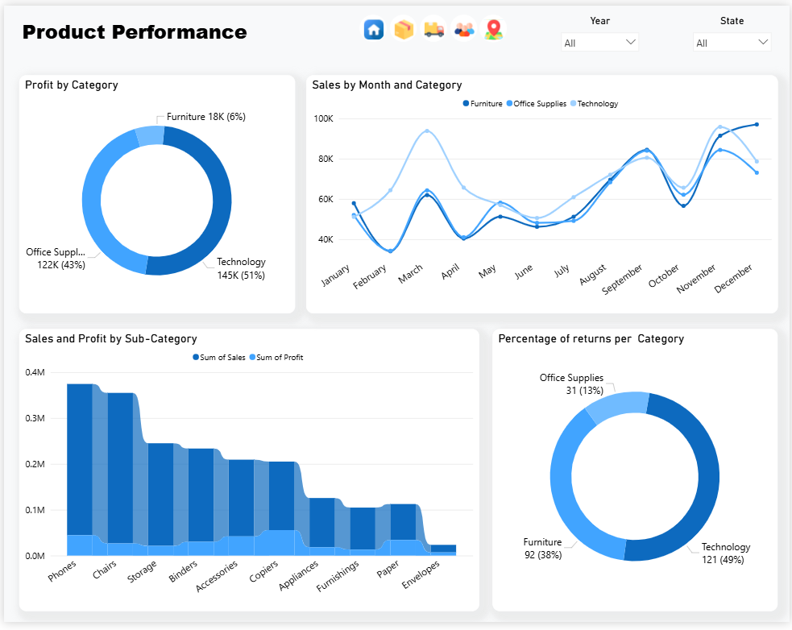
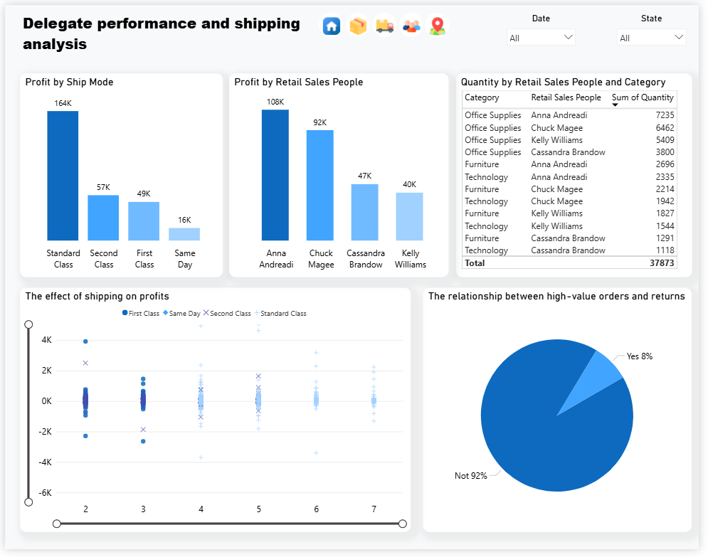
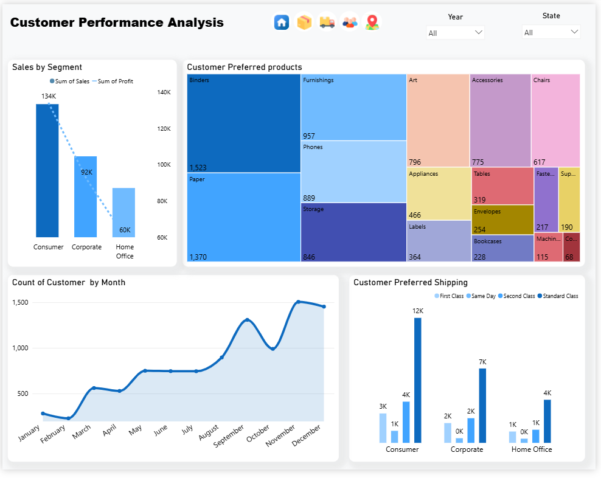
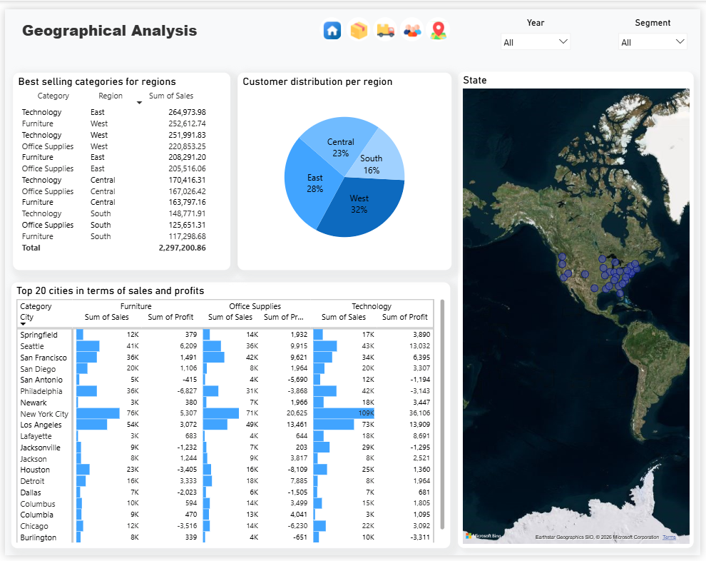

# Sales Performance Dashboard — Power BI

An interactive Power BI dashboard analyzing **$2.3M in retail sales** across **793 customers**, **10K orders**, and **5 analytical pages** — built to surface profitability drivers, identify underperforming markets, and support data-driven decision-making across products, regions, and customer segments.

---

## Business Problem

Retail businesses often track total sales without understanding **where profit is actually generated** — and where it is being silently eroded by discounts, returns, or inefficient shipping. This dashboard answers:

- Which products generate the most profit, not just the most revenue?
- Which cities post high sales but negative profit margins?
- How does shipping mode selection impact overall profitability?
- What seasonal patterns should drive inventory and staffing decisions?
- Which customer segments offer the highest long-term value?

---

## Key Insights

- **Technology** drives **51% of total profit** despite carrying the highest return rate (49%) — strong margins more than offset return costs
- **Copiers** rank #1 in profit ($56K) while not being the top-selling subcategory — a high-margin product worth prioritizing in sales strategy
- **West region** leads with **38% profit share** and the largest customer base (32%) — the most mature and efficient market
- **Philadelphia, Houston, and Chicago** show high sales volumes but **negative profits** — likely driven by excessive discounting or elevated shipping costs
- **Standard Class shipping** generates the highest profit ($164K) vs Same Day ($16K) — customers show low sensitivity to delivery speed
- **92% of high-value orders are never returned** — large-ticket customers are the most committed buyers
- Sales peak in **November–December**, indicating a clear seasonality pattern for inventory planning
- **Furniture** contributes only **6% of total profit** relative to its sales volume — discount policy review needed

---

## Dashboard Pages

| Page | Title | Focus |
|------|-------|-------|
| 01 | Sales Overview | Top-level KPIs, monthly trends, profit by segment and region |
| 02 | Product Performance | Sales vs profit by subcategory, return rates, category trends |
| 03 | Delegate & Shipping | Sales rep performance, shipping mode impact on profit |
| 04 | Customer Analysis | Customer distribution, preferred products, segment behavior |
| 05 | Geographical Analysis | Regional performance, top 20 cities by sales and profit |

---

## Key Metrics

| Metric | Value |
|--------|-------|
| Total Sales | $2.3M |
| Total Profit | $286K |
| Profit Margin | ~12.5% |
| Total Orders | 10K |
| Total Customers | 793 |
| Avg Order Value | $229.86 |
| Customer Lifetime Value (CLV) | $2,900 |
| Total Returns | 800 (~8% of orders) |
| Avg Discount | 16% |

---

## Tools & Technologies

- **Microsoft Power BI Desktop** — dashboard design and interactivity
- **DAX (Data Analysis Expressions)** — custom measures and calculations
- **Power Query (M Language)** — data cleaning and transformation

### DAX Examples

```dax
-- Customer Lifetime Value
CLV = DIVIDE([Total Profit], [Unique Customers])

-- Profit Margin %
Profit Margin % = DIVIDE([Total Profit], [Total Sales])

-- Month-over-Month Sales Change
MoM Sales Change =
VAR CurrentMonth = [Total Sales]
VAR PreviousMonth = CALCULATE([Total Sales], DATEADD('Date'[Date], -1, MONTH))
RETURN DIVIDE(CurrentMonth - PreviousMonth, PreviousMonth)
```

---

## Dashboard Features

- 5 interactive analysis pages
- 20+ dynamic visualizations
- Real-time filtering by Region, Segment, Year, and State
- KPI cards for all headline metrics
- Cross-page navigation buttons

---

## Project Structure

```
/
├── Dashboard/          # Power BI .pbix source file
├── Report/             # Full written analysis report (PDF)
├── Data/               # Raw and cleaned datasets
└── Images/             # Dashboard screenshots for preview
```

---

## Dashboard Preview







---

## Skills Demonstrated

- Data cleaning and transformation with Power Query
- Advanced DAX calculations (CLV, profit margins, MoM growth)
- Interactive dashboard design and UX layout
- Profitability analysis and business insight generation
- Data storytelling across multiple analytical dimensions

---

## Contact

**Ali Rabie**
[LinkedIn](https://www.linkedin.com/in/ali-r-ba4086342/) · [alirabie0128@gmail.com](mailto:alirabie0128@gmail.com)
